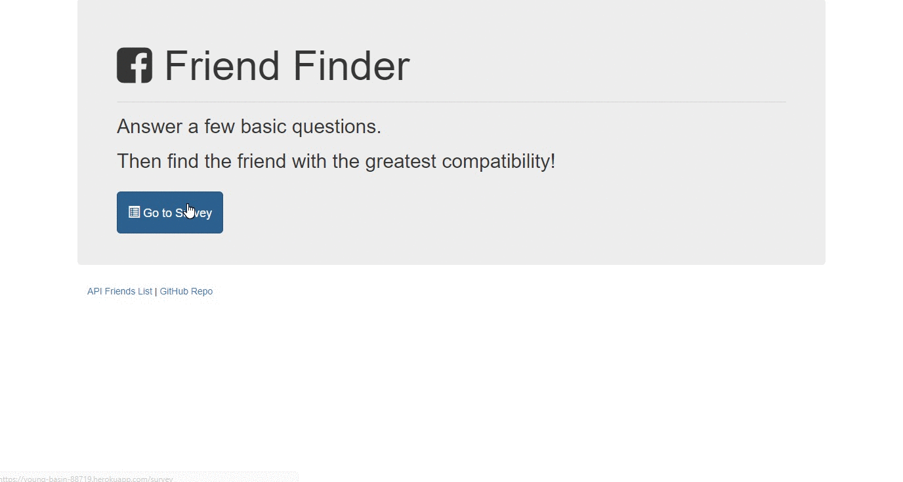

Heroku link:
https://young-basin-88719.herokuapp.com/

"FriendFinder" application is basically a dating app. This full-stack site will take in results from the users' surveys, then compare their answers with those from other users. The app will then display the name and picture of the user with the best overall match. 

- The app use Express to handle routing. In the app, the survey have 10 questions of your choosing. Each answer is on a scale of 1 to 5 based on how much the user agrees or disagrees with a question.

- The server.js file requires the basic npm packages: express, body-parser and path.

- The htmlRoutes.js file includes two routes:
A GET Route to /survey which display the survey page.
A default, catch-all route that leads to home.html which displays the home page. 

- The apiRoutes.js file contains two routes:
A GET route with the url /api/friends. This will be used to display a JSON of all possible friends.
A POST routes /api/friends. This will be used to handle incoming survey results. This route will also be used to handle the compatibility logic. 

- The application's data are saved inside of app/data/friends.js as an array of objects. Each of these objects has the format as below.
{
  "name":"Ahmed",
  "photo":"photo.jpg",
  "scores":[
      5,
      1,
      4,
      4,
      5,
      1,
      2,
      5,
      4,
      1
    ]
}

- Determine the user's most compatible friend using the algorithm as below:
Convert each user's results into a simple array of numbers (ex: [5, 1, 4, 4, 5, 1, 2, 5, 4, 1]).
With that done, compare the difference between current user's scores against those from other users, question by question. Add up the differences to calculate the totalDifference.

Example: 
User 1: [5, 1, 4, 4, 5, 1, 2, 5, 4, 1]
User 2: [3, 2, 6, 4, 5, 1, 2, 5, 4, 1]
Total Difference: 2 + 1 + 2 = 5

- Take the absolute value of the differences. The closest match will be the user with the least amount of difference, then display the result as a modal pop-up with both the name and picture of the closest match.

